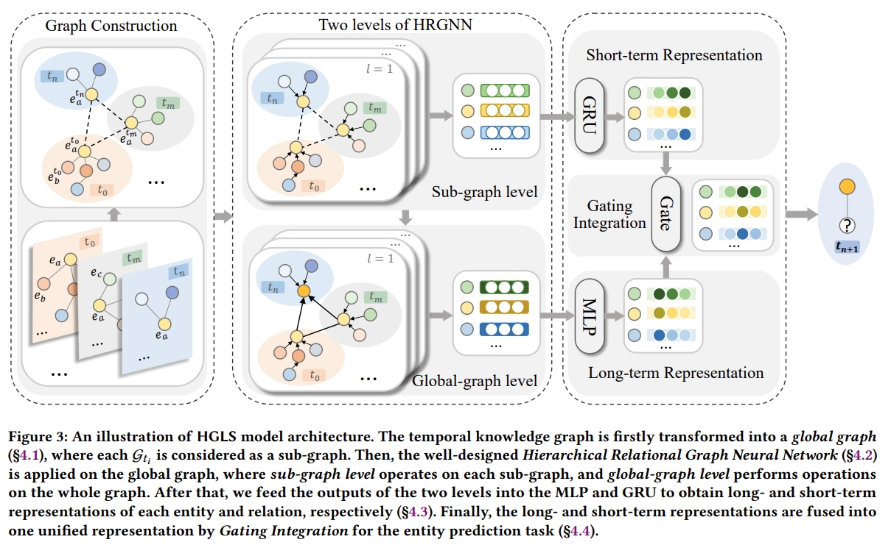

# HGLS



This repository contains the code for the ACM Web Conference (WWW') 2023 paper titled "[Learning Long- and short-term representations for Temporal Knowledge Graph Reasoning](https://dl.acm.org/doi/abs/10.1145/3543507.3583242)". 

## Usage

### Generate data

You need to run the file `generate_data.py` to generate the graph data needed for our model:

```python generate_data.py --data=DATA_NAME```

In order to speed up training and testing, for ICEWS18, ICEWS05-15, and GDELT datasets, data in the required format can be constructed in advance before training and testing:

```python save_data.py --data=DATA_NAME```

### Training and Testing 

Then you can run the file `main.py` to train and test our model. 
The detailed commands can be found in `{dataset}.sh`. Some important hyper-parameters can be found in ```long_config.yaml```
and ```short_config.yaml```.


## Requirements

Make sure you have the following dependencies installed:
- Python~=3.7
- dgl~=0.9.1
- torch~=1.12.1
- numpy~=1.21.5
- tqdm~=4.64.1
- pandas~=1.3.5
- scipy~=1.7.3

## Citation

Please cite our paper if you use the code:

```
@inproceedings{zhang2023learning,
  title={Learning Long-and Short-term Representations for Temporal Knowledge Graph Reasoning},
  author={Zhang, Mengqi and Xia, Yuwei and Liu, Qiang and Wu, Shu and Wang, Liang},
  booktitle={Proceedings of the ACM Web Conference 2023},
  pages={2412--2422},
  year={2023}
}
```

## Acknowledge

Some of our code is also referenced from RE-GCN: [https://github.com/Lee-zix/RE-GCN](https://github.com/Lee-zix/RE-GCN).


